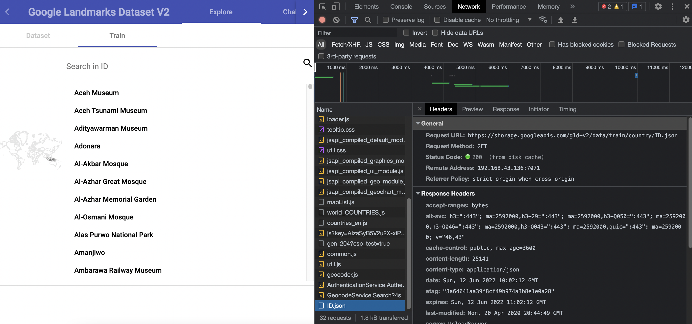

# Machine Learning
This is the machine learning part of our capstone project. Because we have 2 ML people in this capstone team. So we split the tasks, but we constantly ask and help each other when the one of us stuck.
- [Rajendra Salim](https://github.com/rajensalim "Click to go to this link") (M7116K1458), working on the [Sexual/Inappropriate Image Detection Model](#1-filtering-sexualinappropriate-image "Goto this model explanation").
- [Ilyam Faisal](https://github.com/ilyamfaisal28 "Click to go to this link") (M2179F1741), working on the [Landmark Recognition Model](#2-landmark-recognition "Goto this model explanation").

So as you can see above, there are 2 Machine Learning features in our app: 
### 1. Filtering Sexual/Inappropriate Image
We built a sexual image detection model to filter inappropriate contents from the app. The dataset was obtained from Kaggle [https://www.kaggle.com/datasets/drakedtrex/my-nsfw-dataset](url). Transfer learning MobileNetV2 with the input shape 224 x 224 x 3 was used and a few layers such as flatten, dropout, and dense layers with ‘sigmoid’ activation as the output activation were added. The dataset consists of 1676 images divided into 1400 train images and 200 test images. The train images were further divided into NSFW and SFW. The idea behind this model is to classify whether the images uploaded were sexual or not. 
### 2. Landmark Recognition
We built the landmark detection model (especially Indonesian landmark) using MobileNetV2 with the input shape 300 x 300 x 3, and added a few layers such as GlobalAveragePooling2D and dense layers with ‘softmax’ activation as the output activation.\
The dataset is from [Google Landmark Recognition Competition 2020](https://www.kaggle.com/competitions/landmark-recognition-2020/data "Click to go to this link") on Kaggle that are free to use. It has landmark images from all around the world, but we choose Indonesian landmarks only because we think this is suitable for our MVP (Minimum Viable Product). Also because of the time limit for 1 month to finish this capstone project.\
\
How can we get the Indonesian landmarks dataset only?

We got this by scraping to the website version of
that dataset, which is this: https://storage.googleapis.com/gld-v2/web/index.html
\
This is the explanation of our approach:
1. Open the website, then click on 'Explore' and find Indonesia
2. After that, do inspect element to that website and find the JSON url (for Indonesia region the JSON name is ID.json, so find this). Here for the detail:
 
3. Then, run the notebook on Google Colab for scraping each url of all image. The notebook is included in 'Landmark Recognition Model' folder above.
4. After we get all image link. Download all that link using chrome extention.
5. Upload all downloaded images to google drive.
6. Resize images to 800x800 using notebook that included in Landmark Recognition Model folder above.
7. Download resized images, then rename all images and folders into number, this is for the id later use in code. The renamed dataset is already in 'Landmark Recognition Model' folder above.
8. Make csv file according to each file name. You can see csv file like in 'Landmark Recognition Model' --> 'Dataset_Indonesian_Landmark' folder above.
9. Zip that renamed dataset, then upload it on kaggle.
10. Use that dataset in source code.

